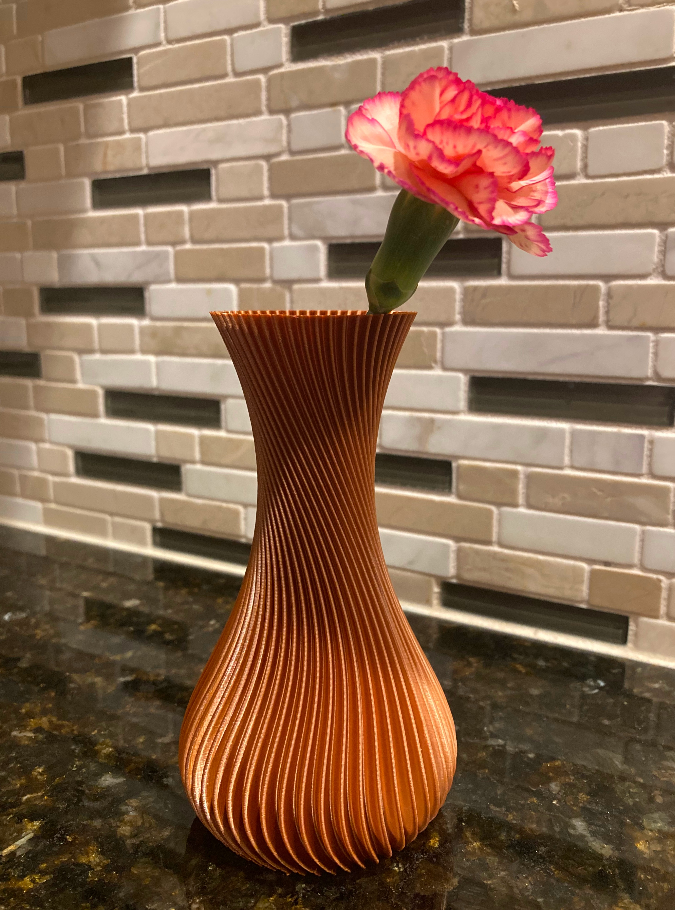

# isosurface-vase
Use scalar fields to create surfaces for 3D printing in vase mode.

For now, this project generates a hard coded vase design.


I scaled, stretched, and cut this model in my slicer to 3D print this:



## Usage

To generate the vase and save it as `vase.stl`:

```
$ python isosurface_vase/vase.py --no-draft
```

Or, run the script in draft mode to see results much more quickly:

```
$ python isosurface_vase/vase.py
```

For more invocation options:

```
$ python isosurface_vase/vase.py --help
```